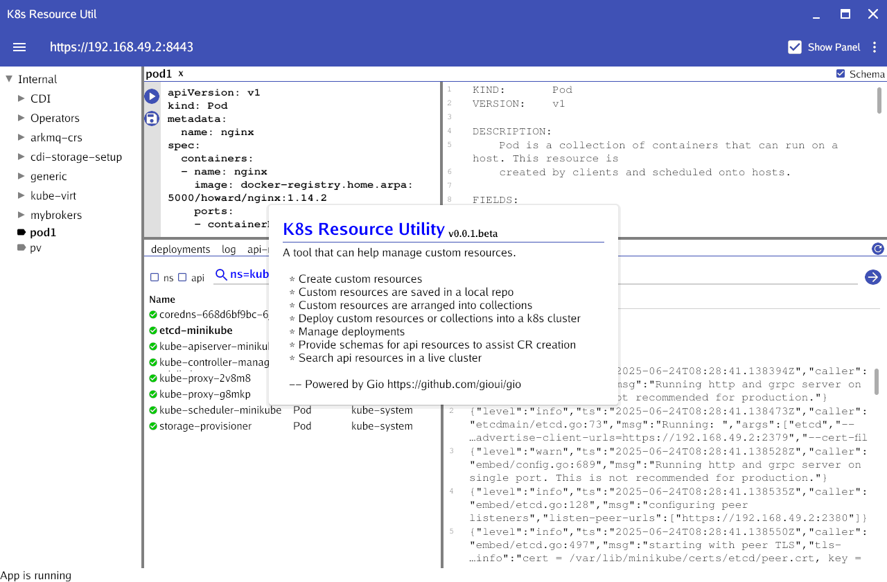

# Kubernetes Resources Utility

- [](https://deepwiki.com/gaohoward/k8s-resource-util)

This is a tool that help users to manage Kubernetes resources.
User can use this tool to create resources. The resources are grouped into collections that can be deployed together with some common purposes. For example a collection of resources usually can be deployed in to one namespace.

It is based on https://github.com/gioui/gio



## Features

- Generating template contents based on kinds
- Cr editing
- Repository save and load
- Deployment management
- Showing Schema for a kind
- in app logging

## Getting Started

1. Clone the repository:
  ```bash
  git clone https://github.com/gaohoward/k8s-resource-util.git
  ```
2. Navigate to the project directory:
  ```bash
  cd k8s-resources-util
  ```
3. Building (Require Go Lang)
  ```
  go build
  ```
4. Starting
  ```
  ./resutil
  ```
You can add an option flag `kubeconfig` to use a different k8s config. For example
  ```
  ./resutil --kubeconfig <kube config file path>
  ```
If not specified, the resutil will use $HOME/.kube/config

## Note

* You need have access to a running k8s cluster to use much of its functionalities. You can easily set up a local Minikbe or Openshift Local (CRC) for testing purposes.

* If you get the following build error:
```
Package 'xkbcommon-x11' not found
```
You need to install the missing dependencies described [here](https://gioui.org/doc/install/linux)

[See this for more info on other platforms](https://gioui.org/doc/install/)

## Note

* Currently this tool is developed on Fedora Linux only.

## Contributing

Contributions are welcome! Please submit a pull request or open an issue for any suggestions or improvements.

## License

This project is licensed under the [MIT License](LICENSE).
